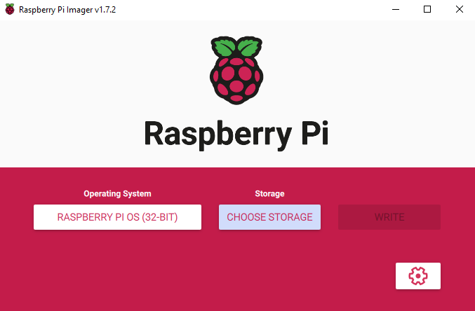
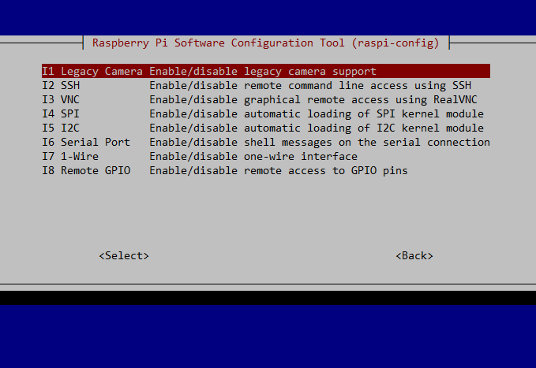
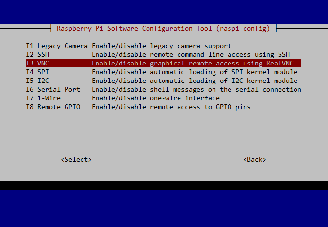

## Raspbery Pi Camera Tutorial
### OS Installation to Raspberry PI and First Connection
First, install the latest version Raspberry Pi OS with the help of Raspberry Pi Imager program. This program simplifies burning OS images to Raspberry Pi capable SD card, you can choose the regular OS(Raspberry Pi OS or Ubuntu) or other fun software like game emulators.



At the Settings, you can give hostname to your Raspberry Pi, change SSH, username, password, WLAN configuration etc. If you do not do WLAN configuration, you will need to plug Ethernet cable to Raspberry Pi for network connection. Take note of hostname, username and password in the Settings section.

After selecting OS, target SD Card and burning your desired OS image with WRITE button to SD card, put that card to Raspberry Pi SD card slot and give the power. If you have not done WLAN config, remember to plug Ethernet cable also.

Connect to your Raspberry Pi with ssh;

`$ ssh pi@raspberrypi  # Default username and hostname`

### Setting Up Camera
To enable camera support in Raspberry Pi;

`$ sudo raspi-config`

In the opened Config Tool, go to Interface Options. In the opened menu, select Camera(or Legacy Camera if you are using old cameras) and enable it.



There are visual guides on the internet on how to connect your camera to Raspberry Pi, so I am skipping it. But be sure that you have chosen the correct connection. On Raspberry Pi 3B, there are DISPLAY and CAMERA connections with the same pin structure, I misconnected at my first try. These connections are tagged correctly, so it would be a good idea for me to read first, plug later to the CAMERA connection :).

If you enabled camera via Raspberry Pi Config Tool and plugged the camera correctly, it should be detected. Most camera modules have power led indicating your camera is powered. To check if your camera is properly detected;

```
$ vcgencmd get_camera
supported=1 detected=1, libcamera interfaces=0
```

### Taking Your First Photo With Camera
Here is the short Python script that shoots a photo and records it.

```
from picamera import PiCamera
import time

camera = PiCamera()
camera.resolution = (1920, 1080) # Resolution is optional

camera.start_preview()
time.sleep(2)

camera.capture("test.jpg")
```


If there is no error, you should see test.jpg from the dir where you executed the script.

### Displaying The Photo
The photo is saved but how can we access and display it. There are two simple ways.

#### Copying The Photo From Raspberry PI To Your Own Computer
Copy the image from Raspberry Pi with **scp** command

`$ scp pi@raspberrypi:/path/to/photo.jpg /path/in/your/computer`

Then open the photo with your image viewer program.

#### Remote VNC Connection To Raspberry Pi
You can also connect to Raspberry Pi via VNC from your own computer. Raspberry Pi OS, that we installed, has GUI support by default.

First, enable VNC server on your Raspberry Pi;

`$ sudo raspi-config`

In the opened Config Tool, go to Interface Options. In the opened menu, select VNC and enable it.



Then, use a VNC Viewer program to connect to Raspberry Pi. Like SSH, you need to use Raspberry Pi hostname(raspberrypi by default, if you do not give a custom name). Proceed to directory where test.jpg is saved and open the image in Raspberry Pi.

Note: Since the VNC connection provides low quality graphics, your photo will look worse on the display with this method.

### In-memory Processing of the Image
In addition to saving images to a file, we can also use them in-memory for variety of purposes such as real-time image processing. Here is the relevant section in **picamera** documentation;

[picamera Documentation](https://picamera.readthedocs.io/en/release-1.13/recipes1.html#capturing-to-a-pil-image)

### Useful URLs
[Raspberry Pi Camera](https://www.amazon.de/gp/product/B07ZZ2K7WP/ref=ppx_yo_dt_b_asin_title_o00_s00?ie=UTF8&psc=1)

[Raspberry Pi 3B](https://www.raspberrypi.com/products/raspberry-pi-3-model-b/)

[Raspberry Pi Imager](https://www.raspberrypi.com/software/)


